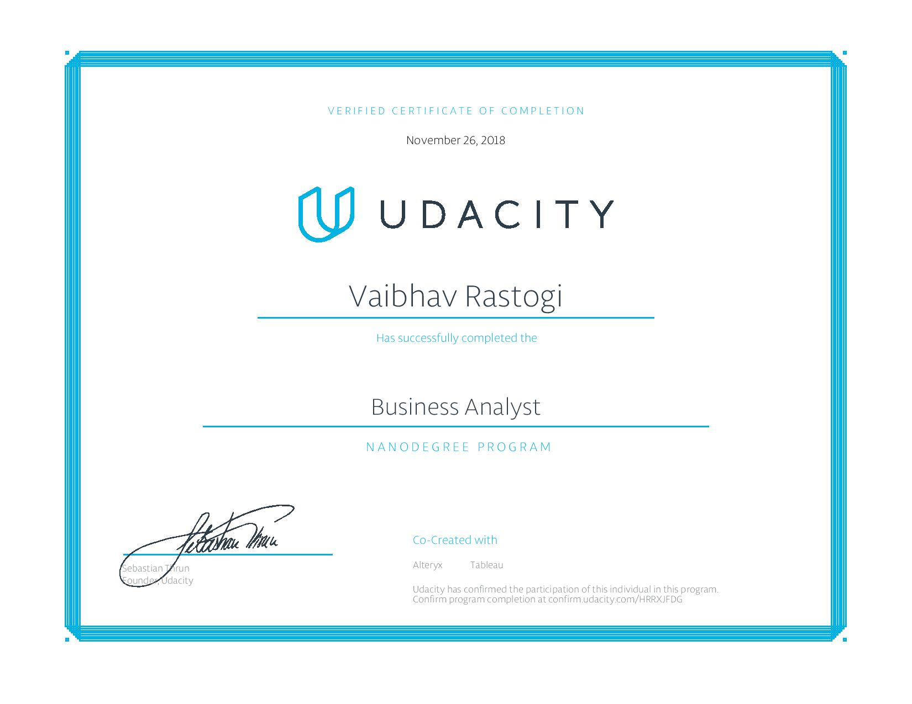

# Business_Analytics_Alteryx_Tableau
Projects done as a part of business analyst nanodegree

This file repository contains the following projects
Project Name  | Description
------------- | -------------
Project 1  | Predicting Diamond Prices - Linear Regression
Project 2  | Predicting catalog demand - linear regression
Project 3 | Tableau visualization project - links to public gallery
Project 4 | Credit default classification project - random forest, decision tree, logistic regression
Project 5 | AB Testing and analysis
Project 6 | Time series forecast video game sales
Project 7 | Segmentation and prediction project
